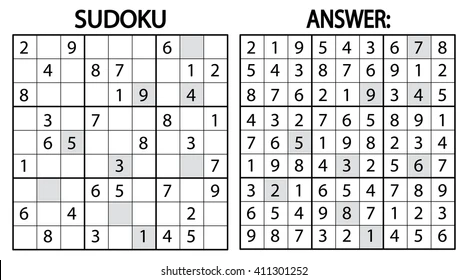

# How To Play Sudoku

## Goals

Fill out all the squares without repeating any numbers.

## Rules

- Numbers **1-9**.
- **Dont't repeat** any numbers within rows, columns and squares (3x3).
- Sudoku is played on grid of **9 X 9 spaces**.

> See [How To play Sudoku for complete beginners](https://sudoku.com/how-to-play/sudoku-rules-for-complete-beginners/)
